# Nexus Agents: Multi-Agent Deep Research System

A sophisticated multi-agent system designed for continuous, iterative, and deep research on complex topics. The system produces "living documents" that evolve with new information, leveraging Agent-to-Agent (A2A) communication and Model-Context-Protocol (MCP) for tool integration.

## 🏗️ Architecture Overview

The Nexus Agents system implements a hierarchical multi-agent architecture with the following layers:

```mermaid
graph TB
    %% Web Interface Layer
    UI["🌐 Web UI<br/>(Port 12001)"] --> API["🚀 API Server<br/>(Port 12000)"]
    
    %% API and Queue Layer
    API --> RQ["📋 Redis Queue<br/>(Task Management)"]
    API --> DB[("🐘 PostgreSQL<br/>(Knowledge Base)")]
    
    %% Worker and Orchestration Layer
    RQ --> W["⚙️ Worker Process<br/>(Background)"]
    W --> RO["🎯 Research Orchestrator<br/>(Workflow Coordination)"]
    W --> CB["📡 Communication Bus<br/>(Redis Pub/Sub)"]
    
    %% Agent Orchestration
    W --> NA["🤖 Nexus Agents<br/>(Orchestrator)"]
    
    %% Research Planning Agents
    NA --> TDA["📋 Topic Decomposer<br/>Agent"]
    NA --> PA["📝 Planning<br/>Agent"]
    
    %% Search Agents Layer
    NA --> SA["🔍 Search Agents"]
    SA --> LSA["🌐 Linkup<br/>Search Agent"]
    SA --> ESA["🔬 Exa<br/>Search Agent"]
    SA --> PSA["🧠 Perplexity<br/>Search Agent"]
    SA --> FSA["🕷️ Firecrawl<br/>Search Agent"]
    
    %% MCP Integration
    LSA --> MCP1["📡 MCP Server<br/>(Linkup)"]
    ESA --> MCP2["📡 MCP Server<br/>(Exa)"]
    PSA --> MCP3["📡 MCP Server<br/>(Perplexity)"]
    FSA --> MCP4["📡 MCP Server<br/>(Firecrawl)"]
    
    %% Analysis Agents
    NA --> SUA["📄 Summarization<br/>Agent"]
    NA --> RA["🧭 Reasoning<br/>Agent"]
    
    %% Data Persistence
    NA --> DB
    NA --> FS["📁 File Storage<br/>(Artifacts)"]
    
    %% LLM Integration
    TDA --> LLM["🤖 Multi-Provider<br/>LLM Client"]
    PA --> LLM
    SUA --> LLM
    RA --> LLM
    
    %% External APIs
    LLM --> OpenAI["OpenAI"]
    LLM --> Anthropic["Anthropic"]
    LLM --> Google["Google"]
    LLM --> XAI["xAI"]
    
    %% Styling
    classDef webLayer fill:#e1f5fe,stroke:#01579b,stroke-width:2px
    classDef apiLayer fill:#f3e5f5,stroke:#4a148c,stroke-width:2px
    classDef agentLayer fill:#e8f5e8,stroke:#1b5e20,stroke-width:2px
    classDef mcpLayer fill:#fff3e0,stroke:#e65100,stroke-width:2px
    classDef dataLayer fill:#fce4ec,stroke:#880e4f,stroke-width:2px
    classDef llmLayer fill:#f1f8e9,stroke:#33691e,stroke-width:2px
    
    class UI webLayer
    class API,RQ apiLayer
    class W,CB,NA,TDA,PA,SA,LSA,ESA,PSA,FSA,SUA,RA agentLayer
    class MCP1,MCP2,MCP3,MCP4 mcpLayer
    class DB,FS dataLayer
    class LLM,OpenAI,Anthropic,Google,XAI llmLayer
```



### 1. Orchestration & Coordination Layer
- **Task Manager**: Central state machine managing research workflows
- **Communication Bus**: Redis-based pub-sub messaging for A2A communication
- **Agent Spawner**: Dynamic agent lifecycle management

### 2. Research Planning & Topic Decomposition
- **Topic Decomposer Agent**: Breaks complex queries into hierarchical sub-topics
- **Planning Module**: Creates execution plans and schedules

### 3. Parallel Search & Data Retrieval
- **Search Agents**: Specialized agents for each search provider
  - Linkup Search Agent (web search)
  - Exa Search Agent (semantic search)
  - Perplexity Search Agent (AI-powered search)
  - Firecrawl Search Agent (web scraping)
- **MCP Integration**: Proper Model Context Protocol implementation

### 4. Summarization & Higher-Order Reasoning
- **Summarization Agents**: Transform raw data into insights
- **Reasoning Agents**: Synthesis, analysis, and evaluation

### 5. Data Persistence & Living Documents
- **PostgreSQL Knowledge Base**: Production-grade database with full ACID compliance and connection pooling
- **Research Workflow Storage**: Complete task lifecycle tracking with metadata, reports, and operation evidence
- **File Storage**: Binary files stored on disk with metadata tracking
- **Artifact Generation**: Multiple output formats (Markdown, PDF, CSV, dashboards)

#### PostgreSQL Architecture

The system uses **persistent connection pooling** for robust concurrent access:

- **Connection pooling**: Managed pool of 5-20 persistent connections for optimal performance
- **Full concurrency**: Multiple processes, agents, and API requests can operate simultaneously
- **ACID compliance**: Proper transaction isolation and data consistency guarantees
- **Research workflow tracking**: Complete task lifecycle from creation to final report generation

This architecture enables stable multi-agent concurrent operations with proper data isolation and consistency.

## 🚀 Features

- **Multi-Provider LLM Support**: OpenAI, Anthropic, Google, xAI, OpenRouter, Ollama
- **Proper MCP Implementation**: Official MCP servers for external tool access
- **Continuous Research**: Persistent agents that evolve knowledge over time
- **Hierarchical Processing**: Tree-of-thoughts approach to complex queries
- **Human-in-the-Loop**: Interactive refinement and feedback mechanisms
- **Scalable Architecture**: Horizontal scaling and resilient error handling

## 📦 Installation

### Prerequisites
- Python 3.12+
- Node.js 18+ (for MCP servers)
- Redis (for agent communication) or Docker

### Quick Start with Development Environment

The easiest way to get started is using our unified development startup script:

```bash
# Clone the repository
git clone https://github.com/trilogy-group/nexus-agents.git
cd nexus-agents

# Install Python dependencies
uv sync

# Start PostgreSQL and Redis with Docker Compose
docker compose up -d

# Copy environment variables
cp .env.example .env
# Edit .env and add your API keys

# Start all services (API, Web UI)
./scripts/start_dev.sh

# Access the services:
# - Web UI: http://localhost:12001
# - API Docs: http://localhost:12000/docs
# - Redis: localhost:6379

# Stop all services (keeps Redis running by default)
./scripts/stop_dev.sh

# Stop all services including Redis
./scripts/stop_dev.sh --all
```

The startup script will:
1. Start Redis (using Docker if available, otherwise local redis-server)
2. Setup MCP servers if not already installed
3. Validate MCP configuration and API keys
4. Start the API backend on port 12000
5. Start the Web UI on port 12001
6. Follow logs in real-time

### Manual Installation

### Setup

1. **Clone the repository**:
```bash
git clone https://github.com/trilogy-group/nexus-agents.git
cd nexus-agents
```

2. **Install Python dependencies**:
```bash
uv sync
```

3. **Set up MCP servers and environment**:
```bash
# Run the automated setup script
bash scripts/setup_mcp_servers.sh
```

4. **Configure API keys**:
```bash
cp .env.example .env
# Edit .env with your API keys for the MCP servers you want to use:
# - FIRECRAWL_API_KEY
# - EXA_API_KEY  
# - PERPLEXITY_API_KEY
# - LINKUP_API_KEY
```

5. **Validate setup**:
```bash
uv run python scripts/validate_mcp_setup.py
```

## 🔧 Configuration

### ⚠️ API Key Security - Important Notice

**API keys are NEVER stored in configuration files!** The `config/mcp_config.json` file contains empty placeholder values (`""`) for API keys that are completely ignored by the system.

```json
// ❌ DO NOT PUT REAL API KEYS HERE!
"env": {
  "FIRECRAWL_API_KEY": "",  // ← This empty string is ignored
  "EXA_API_KEY": ""         // ← Only environment variable names matter
}
```

**✅ ALWAYS export API keys as environment variables:**
```bash
export FIRECRAWL_API_KEY=your_actual_firecrawl_key
export EXA_API_KEY=your_actual_exa_key
export PERPLEXITY_API_KEY=your_actual_perplexity_key
export LINKUP_API_KEY=your_actual_linkup_key
```

The configuration file only tells the system **which environment variable names to look for** - it never reads the placeholder values.

### MCP Server Configuration

The system uses official Model Context Protocol (MCP) servers. Configuration is managed through `config/mcp_config.json`:

- **Firecrawl**: Web scraping and crawling (`uv run firecrawl-mcp`)
- **Exa**: Web search (`uv run exa-mcp-server`)  
- **Perplexity**: AI-powered search (`uv run mcp-server-perplexity-ask`)
- **Linkup**: Web search (`uv run python -m mcp_search_linkup`)

### Environment Variables

Create a `.env` file with the following variables:

```env
# LLM Provider API Keys
OPENAI_API_KEY=your_openai_key
ANTHROPIC_API_KEY=your_anthropic_key
GOOGLE_API_KEY=your_google_key
XAI_API_KEY=your_xai_key
OPENROUTER_API_KEY=your_openrouter_key

# Search Provider API Keys
LINKUP_API_KEY=your_linkup_key
EXA_API_KEY=your_exa_key
PERPLEXITY_API_KEY=your_perplexity_key
FIRECRAWL_API_KEY=your_firecrawl_key

# Database Configuration
REDIS_URL=redis://localhost:6379
DUCKDB_PATH=./data/nexus.db
STORAGE_PATH=./data/storage
```

## 🚀 Installation & Setup

### Prerequisites
- **Python 3.12+**
- **Redis server** (for task queue and messaging)
- **Node.js** (for MCP servers)

### Quick Start

1. **Clone and setup**:
   ```bash
   git clone <repository-url>
   cd nexus-agents
   uv sync
   ```

2. **Install MCP servers**:
   ```bash
   ./scripts/setup_mcp_servers.sh
   ```

3. **Configure API keys** (create `.env` file):
   ```bash
   # Required for LLM operations
   OPENAI_API_KEY=sk-your_openai_key
   
   # Required for search providers  
   FIRECRAWL_API_KEY=fc-your_firecrawl_key
   EXA_API_KEY=your_exa_key
   PERPLEXITY_API_KEY=pplx-your_perplexity_key
   LINKUP_API_KEY=your_linkup_key
   ```

4. **Start the system**:
   ```bash
   ./scripts/start_dev_full.sh
   ```

## 🌐 Web Interface Usage

The system is designed to be used through its web interface:

- **Web UI**: http://localhost:12001
- **API Backend**: http://localhost:12000

### Creating Research Tasks

1. **Open the web interface** in your browser
2. **Enter your research topic** in the input field
3. **Select research mode**:
   - **Single**: One-time research task
   - **Continuous**: Ongoing research with updates
4. **Click "Start Research"** to begin
5. **Monitor progress** in real-time:
   - Topic decomposition phase
   - Research planning phase
   - Multi-provider search execution
   - Summarization and analysis

### Features

- ✅ **Real-time Updates**: Task status updates automatically every 5 seconds
- ✅ **Progress Tracking**: Visual progress through research phases
- ✅ **Multi-provider Search**: Simultaneous searches across 4 providers
- ✅ **Rich Results**: View summaries, insights, and generated artifacts
- ✅ **Loading States**: Clear visual feedback during processing
- ✅ **Error Handling**: Graceful handling of API failures

### Development Mode

For development and debugging:

```bash
# View logs
tail -f logs/worker.log

# Restart system cleanly
rm logs/worker.log && ./scripts/stop_dev.sh --all && ./scripts/start_dev_full.sh

# Check system status
curl http://localhost:12000/health
```

## 🔍 Search Providers

The system integrates with multiple search providers through the Model Context Protocol (MCP):

- **🌐 Linkup**: Web search capabilities
- **🔬 Exa**: Semantic search and research papers
- **🧠 Perplexity**: AI-powered search and analysis
- **🕷️ Firecrawl**: Web scraping and content extraction

All providers are automatically configured and managed by the system.

## 📊 Data Storage

The system uses **DuckDB** for lightweight, JSON-native data storage:
- Research tasks and status tracking
- Search results and analysis
- Generated artifacts and reports
- No external database setup required

### File Storage

Binary files are stored on disk with metadata references in the database:
- Documents: PDF, DOCX, etc.
- Images: PNG, JPG, etc.
- Data files: CSV, JSON, etc.

## 🔄 Continuous Research

The system supports continuous research modes:

1. **One-shot Research**: Single query execution
2. **Iterative Research**: Multi-round refinement
3. **Continuous Monitoring**: Ongoing information updates
4. **Living Documents**: Auto-updating research artifacts

## 🛠️ Development

### Development Scripts

The project includes comprehensive development scripts for managing the full system:

#### Starting the System

```bash
# Start the complete system (API + Worker + Web UI + Redis)
./scripts/start_dev.sh
```

#### Stopping the System

```bash
# Stop all services
./scripts/stop_dev.sh --all

# Stop specific services (will detect and stop running processes)
./scripts/stop_dev.sh
```

#### Standardized Restart Procedure

For worker debugging and system restarts, use this standard workflow:

```bash
# Clean restart with fresh logs
rm logs/worker.log && ./scripts/stop_dev.sh --all && ./scripts/start_dev.sh
```

This ensures:
- All services are cleanly stopped
- Fresh log files are created
- Complete system is restarted in the correct order
- Redis, API, Worker, and Web UI are all running

#### Service URLs

When running the full development environment:

- **API Backend**: http://localhost:12000
- **API Documentation**: http://localhost:12000/docs
- **Web UI**: http://localhost:12001
- **Redis**: localhost:6379

#### Log Files

- **API Logs**: `logs/api.log`
- **Worker Logs**: `logs/worker.log`
- **Web UI Logs**: `logs/web.log`

### Project Structure

```
nexus-agents/
├── src/
│   ├── orchestration/          # Core coordination layer
│   ├── research_planning/      # Topic decomposition and planning
│   ├── search_retrieval/       # Search agents and MCP integration
│   ├── summarization/          # Analysis and reasoning agents
│   ├── data_persistence/       # Knowledge base and storage
│   ├── llm/                    # Multi-provider LLM client
│   ├── config/                 # Configuration management
│   └── mcp_client_simple.py    # MCP client implementation
├── external_mcp_servers/       # External MCP server installations
├── tests/                      # Test suite
├── config/                     # Configuration files
└── requirements.txt            # Python dependencies
```

### Adding New Search Providers

1. Install the MCP server for the provider
2. Add server configuration to `SimpleMCPClient`
3. Create a new search agent in `src/search_retrieval/`
4. Update the system configuration

### Contributing

1. Fork the repository
2. Create a feature branch
3. Implement changes with tests
4. Submit a pull request

## 📝 Current Status

### ✅ Completed Features

- **Full system architecture implemented**
- **Multi-provider LLM client with 6 providers**
- **Proper MCP integration with 4 official servers**
- **DuckDB-based knowledge base**
- **Complete agent hierarchy**
- **A2A communication infrastructure**
- **Comprehensive test suite**

### 🔄 In Progress

- **MCP client connection stability** (simplified client working)
- **Redis integration for full A2A communication**
- **End-to-end workflow testing with real API keys**

### 🎯 Next Steps

1. **Production Deployment**: Docker containerization and cloud deployment
2. **Web Interface**: React-based dashboard for research management
3. **Advanced Analytics**: Research quality metrics and insights
4. **Plugin System**: Extensible architecture for custom agents

## 📄 License

This project is licensed under the MIT License - see the [LICENSE](LICENSE) file for details.

## 🤝 Support

For questions, issues, or contributions:

- **GitHub Issues**: [Report bugs or request features](https://github.com/trilogy-group/nexus-agents/issues)
- **Documentation**: [Full documentation](https://docs.nexus-agents.com)
- **Community**: [Join our Discord](https://discord.gg/nexus-agents)

---

**Nexus Agents** - Transforming how we conduct deep research through intelligent multi-agent collaboration.
